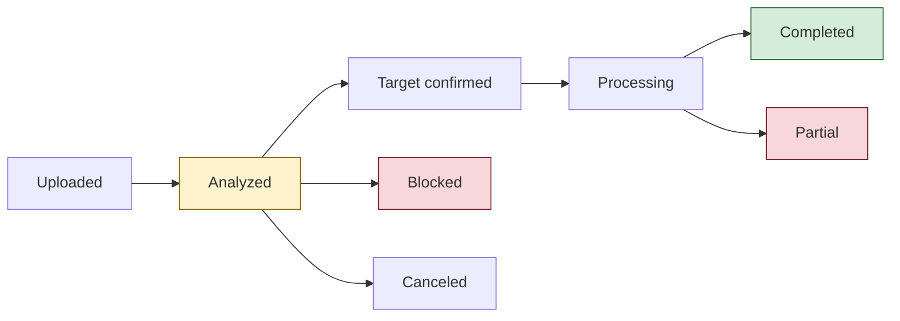

# Timetastic Import - Moving Your Leave History Into Timebreez

## Who This Is For
**Admins** who are moving an organisation from Timetastic to Timebreez and need to bring across staff, leave history and opening balances - and anyone who has started an import and is not sure whether it finished.

## What You'll Learn
- What the Timetastic import does, and the nine steps it walks you through
- What each import status means, and why **"Analyzed" does not mean finished**
- How to map Timetastic leave types to Timebreez leave types
- Why leave balances can still show **0** after an import, and how to fix it
- How to safely re-run an import that is stuck
- Why re-uploading a *changed* file is risky, and what to do instead
- How to read the reconciliation report and roll a run back

## Prerequisites
- **Admin** role in Timebreez
- A full export from Timetastic (the workbook containing users, leave bookings and balances)
- The organisation you are importing into already exists in Timebreez

---

## Quick Start (TL;DR)

1. Go to **Admin > Timetastic import**
2. **Upload** your Timetastic workbook
3. Work down the panels: **Analyze > Organization > Staff gaps > Leave type mapping > Import plan**
4. Press **Execute** - the import does not run until you do this
5. **Approve the balance adjustments** afterwards, or everyone's balance will still read 0
6. Check **Reconcile** to confirm the numbers match

> **The two things people get wrong:** stopping at "Analyzed" and thinking the import is done, and forgetting step 5. Both leave you with an organisation full of staff and no leave balances.

---

## Understanding the Import

### What It Does

The Timetastic import reads your Timetastic export and creates, in Timebreez:

- **Employees** - the people in your Timetastic account
- **Leave history** - past and future leave bookings
- **Opening balances** - how much leave each person has left

It is deliberately a **step-by-step process with a manual execute**, not a one-click upload. You get to see exactly what will be created before anything is written, because importing the wrong file into the wrong organisation is painful to undo.

### The Nine Panels

The import page walks top to bottom. You cannot skip ahead.

| Panel | What happens |
|---|---|
| **Upload** | You provide the Timetastic workbook |
| **Analyze** | Timebreez reads the file and summarises what it found |
| **Organization** | You confirm *which* Timebreez organisation this data belongs to |
| **Staff gaps** | Timetastic people who don't yet match a Timebreez employee |
| **Leave type mapping** | Match Timetastic leave types to Timebreez leave types |
| **Import plan** | The full list of what will be created, before anything is written |
| **Execute** | The import actually runs |
| **Reconcile** | Compare what was imported against the source |
| **Gaps queue** | Rows that could not be imported, for retry |

### Import Statuses

This is the part worth reading carefully.

| Status | What it actually means |
|---|---|
| **Uploaded** | The file is in. Nothing has been read yet. |
| **Analyzed** | **Not finished.** The file has been read and understood. Timebreez is waiting for *you* to confirm the organisation and press Execute. Nothing has been written. |
| **Blocked** | Something needs your attention before this can proceed - usually unmapped staff or leave types. |
| **Target confirmed** | You have said which organisation this belongs to. Still not written. |
| **Processing** | The import is running now. |
| **Completed** | Everything imported successfully. |
| **Partial** | The import ran, but some rows failed. Check **Reconcile** and the **Gaps queue**. |
| **Canceled** | Abandoned. Safe to ignore. |

> **"Analyzed" is the one that catches people out.** It looks finished because the page is full of correct-looking data. It is not. Nothing has been written to your organisation until the status reaches Processing or beyond.

---

## Mapping Leave Types

Timetastic's leave types are yours to name; Timebreez has its own list. The **Leave type mapping** panel asks you to connect them - for each **Timetastic type**, choose a **Timebreez type** from the dropdown.

Mappings you set are remembered as **Saved leave mappings**, so a second import of the same organisation is much quicker.

**Current limitation:** some Timetastic leave types cannot be matched exactly, because Timebreez's leave-type list is fixed. Where there is no exact equivalent, pick the closest match and note the difference - the reconciliation report will show you what landed where.

The same applies to people: the **Staff gaps** panel lists Timetastic users with no matching Timebreez employee, and lets you **Map to employee** or create them.

---

## Why Balances Still Show 0 After an Import

This is the single most common "the import is broken" report, and it usually isn't broken.

### Snapshots are evidence, not balances

When the import reads balances out of Timetastic, it stores them as **source snapshots**. The import page says this explicitly:

> Source snapshots are evidence, not balance changes.

A snapshot records *what Timetastic said*. It does **not** change anyone's balance in Timebreez. Balances in Timebreez are built from a ledger, and something has to write to that ledger.

That something is you, approving the adjustment.

### The approval step

After the import has executed, each balance snapshot gets an **Approve after execution** button. Until you press it, the snapshot is just a record and the employee's balance stays at 0.

Before execution the button is deliberately disabled, and hovering it says:

> Run the import first, then approve the persisted snapshot from the adjustment queue.

Some snapshots are marked **reconciliation-only** and *cannot* create balance ledger rows at all - those are there for comparison only and will never affect a balance.

### Troubleshooting: balances show 0

Work down this list in order:

1. **Is the import still at "Analyzed"?** Then it has not run. Confirm the organisation and press **Execute**.
2. **Did it finish as "Partial"?** Some rows failed. Open **Reconcile** and the **Gaps queue** to see which.
3. **Did it complete, but you never approved the balance adjustments?** Approve them. This is the most common cause of a "successful import with no balances".
4. **Does this person genuinely have no leave history in the export?** Then 0 is the correct answer.

If all four check out and balances are still 0, that is worth reporting - see [Troubleshooting](./08-troubleshooting.md).

---

## Re-running and Recovering a Stuck Import

Imports get abandoned halfway. Someone starts one, gets called away, and it sits at **Analyzed** for a fortnight. Here is how to recover safely.

### Re-uploading the SAME file is safe

**If your import is stuck, upload the same file again.**

Timebreez recognises the file and **continues the existing import** rather than starting a second one. You will not get duplicate employees or duplicate leave. The stuck import is simply reset to **Analyzed** so you can carry on from the Organization panel.

An import that has already **Completed**, or that is currently **Processing**, is protected - re-uploading will not reset it or undo your work.

> This is the recommended recovery for any import stuck at Uploaded, Analyzed or Blocked.

### Re-uploading a DIFFERENT file needs care

If you have re-exported from Timetastic, or edited the spreadsheet, it is **not the same file** any more - even if it looks identical and has the same filename. Timebreez will treat it as a **brand-new import**, and the old stuck one stays behind.

That leaves two live imports for one organisation. Timebreez will not stop you running the second one, and if somebody later goes back and runs the first one too, **the same leave gets added twice** and everybody's balances come out wrong. Leave records are only ever added, never silently replaced, so a double-import has to be unpicked by hand.

> **If you have changed or re-exported the file, cancel the old import first.**

To do that: go to **Admin > Timetastic import > Runs**, open the stale run, and cancel it. Then upload the new file.

### Imports belong to the organisation, not to you

If a colleague uploads the same export you have been working on, it continues **your** import rather than starting their own. This is usually what you want - two admins can share the work - but it does mean you should agree who is driving before you both start uploading.

### A note on drafts

Your in-progress mapping choices are saved as a draft. **This is currently unreliable** - navigating away or reloading the page can lose the draft, and you will see **"Import draft is not saved."** on the page when that has happened.

Until this is fixed, try to complete the mapping panels in one sitting, and check for that message before you rely on your work being kept.

---

## Reconciliation and Rollback

### Reconcile

After execution, **Reconcile** compares what is now in Timebreez against what was in the Timetastic file - leave rows, users, bookings, carry-forward, duplicates, blocked items. This is your proof that the import did what it claimed.

The report is saved, so you can come back to it later or show it to someone else.

### Rollback

Each run has a **Rollback** page that undoes what it created.

Rollback relies on Timebreez being able to recognise exactly what it wrote. The import page warns:

> Manual or API edits after import block unsafe rollback.

In plain terms: **if you or anyone else edits the imported records afterwards, rollback may refuse to run**, because it can no longer be certain what belongs to the import and what you have since changed by hand. If you think you might want to roll back, do it before you start editing.

---

## Common Questions

**Do I have to do this in one sitting?**
No, but drafts are currently unreliable (see above), so completing the mapping panels in one go is safer.

**Can I import into the wrong organisation by accident?**
The **Organization** panel exists specifically to prevent this - you must actively confirm the target before anything is written. Read it carefully; it is the last easy off-ramp.

**What if only some rows imported?**
The status will be **Partial**. Open **Reconcile** to see what succeeded and the **Gaps queue** to retry what didn't.

**Will importing twice duplicate everyone?**
Not if it is the same file - Timebreez continues the existing import. It can duplicate if you import a *different* file without cancelling the first one. See above.

**The import says Completed but nobody has any leave balance.**
You almost certainly still need to approve the balance adjustments. See [Why Balances Still Show 0](#why-balances-still-show-0-after-an-import).

---

## Related

- [Staff CSV Import](./21-staff-csv-import.md) - importing employees from a spreadsheet instead
- [Managing leave requests](./admin/leave.md)
- [Troubleshooting](./08-troubleshooting.md)
- [FAQ](./faq.md)
