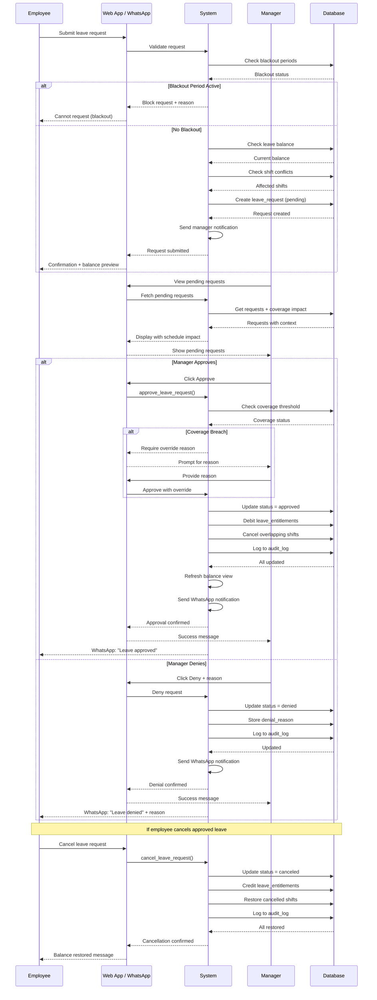

# Leave Request Workflow
{: .fs-9 }

Technical overview of the leave request lifecycle from submission to completion.
{: .fs-6 .fw-300 }

---

## Workflow Overview

The leave request workflow involves three actors:

1. **Employee**: Submits requests via web app or WhatsApp
2. **Manager/Admin**: Reviews and approves/denies requests
3. **System**: Handles automation, notifications, and balance updates

---

## Sequence Diagram



---

## Employee Flow

### Step 1: Navigate to Leave Request

Employee accesses the leave request form via:
- **Web**: `/leave-requests` or **My Schedule** → **Request Leave** button
- **WhatsApp**: Send message like "I need December 15-16 off"

### Step 2: Fill Out Request Form

| Field | Required | Description |
|-------|----------|-------------|
| Leave Type | Yes | Annual, Sick, Emergency, Unpaid |
| Start Date | Yes | First day of leave |
| End Date | Yes | Last day of leave |
| Half-day | No | Morning or afternoon only |
| Reason | No | Optional notes for manager |

### Step 3: System Validation

Before submission, the system checks:

1. **Blackout Periods**: Is any date blocked?
2. **Leave Balance**: Does employee have sufficient balance?
3. **Shift Conflicts**: Are there rostered shifts affected?

### Step 4: Balance Preview

Employee sees impact before confirming:

```
Leave Type: Annual Leave
Duration: 2 days
Current Balance: 16 days
Balance After Approval: 14 days
```

### Step 5: Submit Request

Request is created with `status: pending` and manager is notified.

---

## Manager Flow

### Step 1: View Pending Requests

Managers see pending requests in two places:

1. **Dashboard Widget**: Quick view of first 5 pending requests
2. **Leave Requests Page**: Full list with filtering

### Step 2: Review Request Details

For each request, manager sees:

| Information | Source |
|-------------|--------|
| Employee name | `employees` table |
| Dates requested | `leave_requests` table |
| Leave type | `leave_types` table |
| Duration | Calculated field |
| Current balance | `leave_entitlements` ledger |
| Balance after | Calculated field |
| Shift impact | `shift_instances` table |
| Coverage impact | `check_coverage_impact()` RPC |

### Step 3: Make Decision

**Approve:**
1. Click **Approve** button
2. If coverage threshold would breach → prompted for override reason
3. System debits balance, cancels shifts, sends notification

**Deny:**
1. Click **Deny** button
2. Enter denial reason (required)
3. System updates status, sends notification with reason

---

## System Automation

### On Approval

The `approve_leave_request()` function performs:

1. **Validate** request is still pending
2. **Check coverage** via `check_coverage_impact()`
3. **Debit balance** → insert into `leave_entitlements` with `transaction_type: 'debit'`
4. **Cancel shifts** → update `shift_instances` where dates overlap
5. **Audit log** → record action with metadata
6. **Refresh view** → update materialized balance view
7. **Notify employee** → send WhatsApp message

### On Cancellation

The `cancel_leave_request()` function performs:

1. **Validate** request exists
2. **Credit balance** → insert into `leave_entitlements` with `transaction_type: 'adjustment'`
3. **Restore shifts** → update `shift_instances` back to `scheduled`
4. **Audit log** → record cancellation with restored shift count
5. **Refresh view** → update materialized balance view

### Notifications

WhatsApp notifications are sent for:

| Event | Recipient | Template |
|-------|-----------|----------|
| Request submitted | Manager | New leave request alert |
| Request approved | Employee | Approval confirmation |
| Request denied | Employee | Denial with reason |
| Request cancelled | Manager | Cancellation notice |

---

## Coverage Threshold Override

When approving leave that would breach minimum staffing:

1. System detects coverage would drop below threshold
2. Manager is shown warning with affected dates
3. Manager must provide override reason
4. Override reason is logged in `audit_log.metadata`
5. Approval proceeds with `action: 'approved_with_override'`

---

## Database Tables Involved

| Table | Role |
|-------|------|
| `leave_requests` | Stores request details and status |
| `leave_types` | Defines available leave types |
| `leave_entitlements` | Ledger of balance transactions |
| `employees` | Employee details and role |
| `shift_instances` | Affected shifts |
| `blackout_periods` | Blocked date ranges |
| `coverage_thresholds` | Minimum staffing rules |
| `audit_log` | All actions logged |

---

## Related Technical Files

### Frontend Components

| File | Purpose |
|------|---------|
| `src/features/leave-requests/components/LeaveRequestForm.tsx` | Request submission form |
| `src/features/leave-requests/components/LeaveRequestCard.tsx` | Request display with actions |
| `src/features/dashboard/components/PendingApprovalsWidget.tsx` | Dashboard quick view |

### Hooks

| File | Purpose |
|------|---------|
| `src/features/leave-requests/hooks/useLeaveRequests.ts` | CRUD operations |
| `src/features/leave-requests/hooks/useBlackoutCheck.ts` | Validate against blackouts |
| `src/features/leave-requests/hooks/useCoverageImpact.ts` | Check coverage threshold |
| `src/features/leave-requests/hooks/useShiftConflictCheck.ts` | Detect shift conflicts |

### Database Functions (RPCs)

| Function | Purpose |
|----------|---------|
| `approve_leave_request(UUID, UUID, TEXT)` | Approve with optional override |
| `cancel_leave_request(UUID)` | Cancel and restore balance/shifts |
| `check_coverage_impact(UUID, DATE, DATE)` | Coverage analysis |
| `check_blackout_overlap(UUID, DATE, DATE)` | Blackout validation |

---

## See Also

- [Leave Management](/docs/admin/leave/) - Admin guide for managing leave
- [Requesting Leave](/docs/staff/leave/) - Staff guide for requesting leave
- [WhatsApp Setup](/docs/admin/whatsapp/) - Configure WhatsApp notifications

